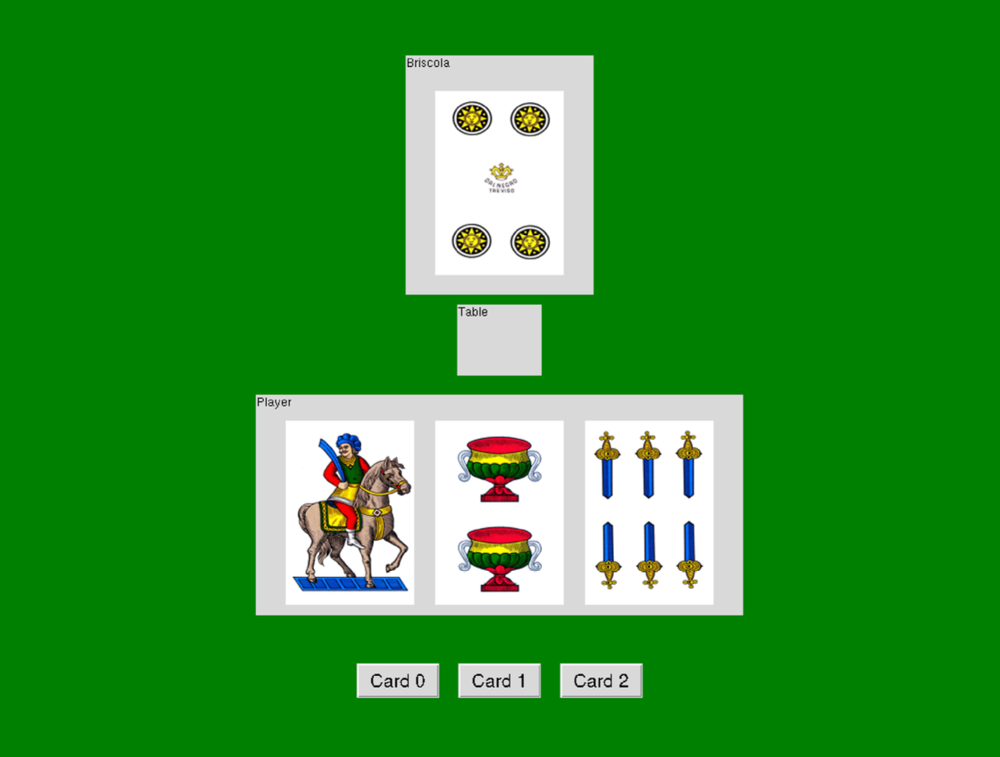

# Training an AI agent in the Game Of Briscola

## Description
This is a simple implementation of the card game Briscola. The game is played between two players, one of which is the computer. The game is played with a deck of 40 cards, and the goal is to score more points than the opponent. The game is played in turns, and each turn consists of two phases: the first player plays a card, then the second player plays a card. The winner of the turn is the player who played the highest card, according to the following order: ace, three, king, queen, jack, seven, six, five, four, two.The game ends when all the cards have been played. The player with the highest score wins the game.

## How to run

Before running, install torch
> pip install torch torchvision torchaudio

then install rlcard:

> pip install .

### Train

Usually something like this:

> python3 ./examples/run_rl_finale.py --log_dir="experiments/briscola_dqn_final/"

### Play against a trained Agent with a GUI interface

- Download model checkpoint from https://huggingface.co/paolvz/briscola_dqn (best checkpoint is the only_round folder)
- Put the checkpoint_dqn.pt-475000 in briscola/experiments/only_round or only_game
- Run this command in briscola folder:

> python3 ./examples/human/briscola_human.py --opp_hand_visible="True" --checkpoint_path="./experiments/**path_to_your_checkpoint**"

### Test
To test different rewards in training phase substitute the files in `Different_Rewards` folder with those in `rlcard/env/Briscola` (game.py)  and `rlcard/utils` (utils.py). Finally, launch the command `pip install .`

## Our code
This repo is  a fork of the official RLCards repo, we modified the following files:
- `examples/run_rl_finale.py`
- `rlcard/env/Briscola/briscola.py`
- `rlcard/env/Briscola` folder
- `rlcard/utils/utils.py`
- `rlcard/agents/dqn_agent.py`
- `rlcard/agents/human_agent.py` and `rlcard/agents/interfaccia.py`
-  `examples/human/briscola_human.py`

and other minor changes in other files.

*Reinforcement Learning exam's project by Matteo Nunziante (github.com/flaccagora), Paolo Vizzo (github.com/paolvz), Noemi Ippolito (github.com/noemiippolito)*

*Master Degree in Data Science and Scientific Computing - University of Trieste*
